# Import/Export app { #import_export }

In a primary health system, the HMIS typically involves a distributed
application, where the same application is running in different
geographical locations (PHCs, CHCs, hospitals, districts, and state).
Many of these physical locations do not have Internet connectivity, so
they work offline. At some point (normally at the district level), the
data must be synchronized to give a consolidated database for a
particular geographical region. For this, it is important to be able to
export data from one location (which is working offline, say at the
health facility level) and import into another one (say at the district
level).
Exporting and importing data is a crucial function of an HMIS.
It also reduces the dependency on the Internet to some degree, because you
can transfer data updates on a USB key where there is no connectivity, or
by email where there is limited Internet connectivity. DHIS2 provides
import and export functions for these needs.

To open the Import/Export app, search for Import/Export in the top header
bar. The app offers several services, described in the following sections.

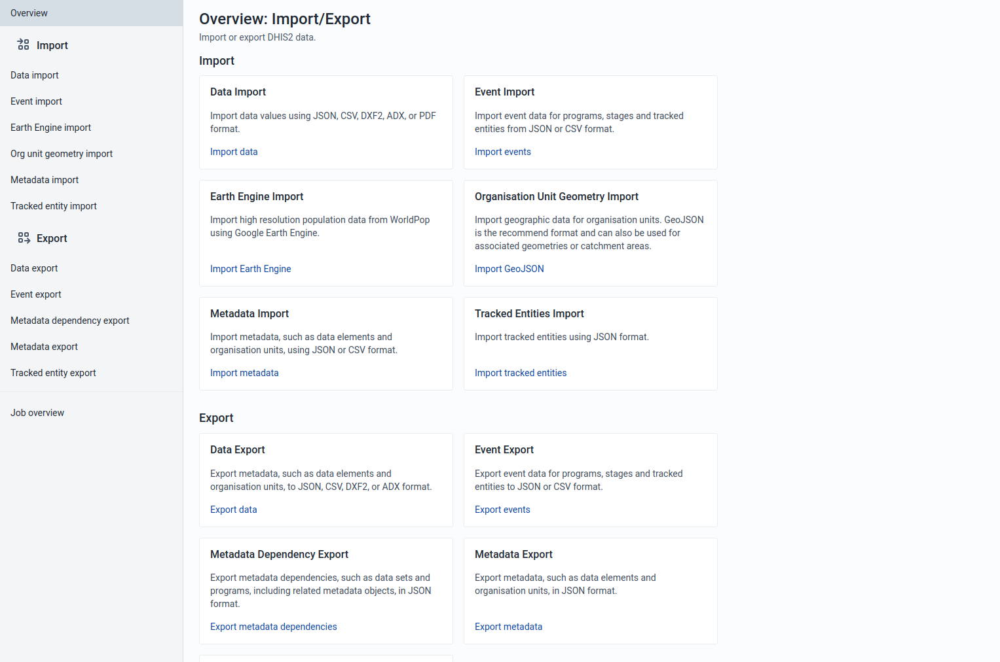

## Importing data { #importing_data }

### Import progress logger { #import_progress_logger }

No matter what you import (**Data**, **Events**, **Org unit geometry**, **Metadata** or **Tracked entity** data), you can always see the progress of the import in the **Job summary** at the top of the page.

### Import summaries { #metadata_import_summaries }

When the import request completes, the app shows import summaries above the
import form. Any conflicts or errors are shown in the table under the
main summary for the import.

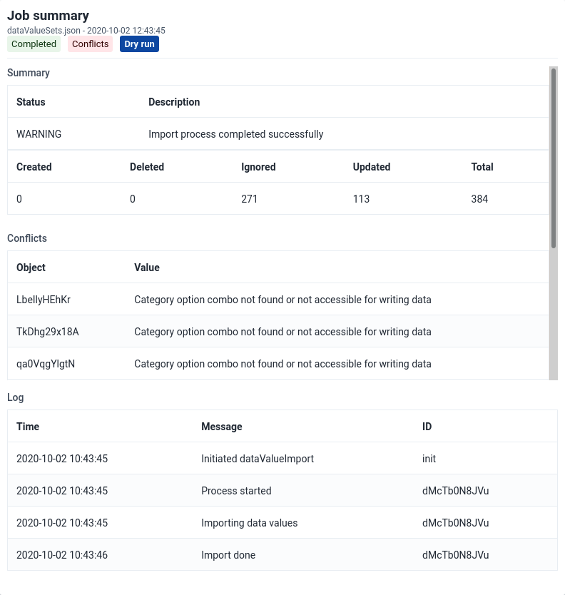

### Metadata import { #metadata_import }

In the sidebar, click **Metadata import**.

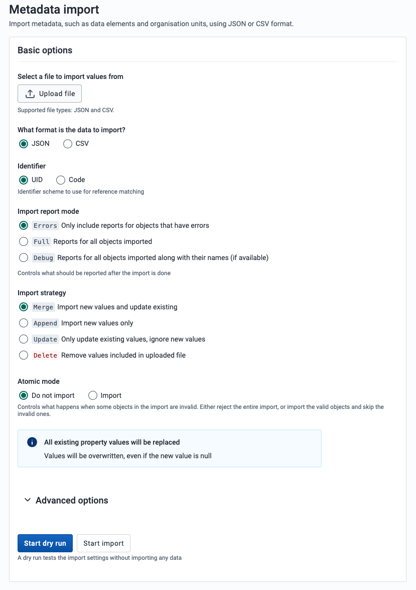

1.  Choose a file to upload.

2.  Select a format: _JSON_ or _CSV_.

3.  Select the appropriate settings for:

    -   Identifier (whether to match existing metadata on UID or code)
    -   Import report mode (level of detail reported after import has finished)
    -   Import strategy (how values should be imported)
    -   Atomic mode (controls what happens when some objects in the import are invalid)

    If you select _CSV_, two more settings appear: _First row is header_ (a header row is ignored during import) and _Class key_ (the type of metadata object in the CSV file).

4.  Click **Advanced options** if you want to adjust one or more of
    the following settings before importing:

    -   Flush mode (controls when to flush the internal cache)
    -   Skip sharing (whether to include or ignore sharing on import)
    -   Skip validation (whether to bypass validation checks during import)
    -   Async (whether import is performed asynchronously)

5.  Click **Start import** to upload the file and start the import.

> **Tip**
>
> It is highly recommended to use the **Dry run** option to test before importing data.
> This keeps you in control of any changes to your metadata, and lets you check for
> problems with out-of-sync data elements or organisation unit names.

> **Note**
>
> For example, if an organisation unit (`Nduvuibu MCHP`) has an unknown reference to an object with ID `aaaU6Kr7Gtpidn`, it means that the object with ID `aaaU6Kr7Gtpidn` was not present in your imported file. It was also not found in the existing database.
>
> You can control this using the **Identifier** option, to indicate whether you want to allow objects with such invalid references to be imported. If you choose to import invalid references, you must correct the reference manually in DHIS2 later.

#### Matching identifiers in DXF2 { #matching_identifiers_in_dxf2 }

The DXF2 format supports matching on two identifiers: the internal DHIS2
identifier (known as a UID), and an external identifier called a "code". When
the importer searches for references (like the one above), it first checks
the UID field, and then the code field. This lets you import from legacy
systems without a UID for every metadata object. For example, if you import
facility data from a legacy system, you can leave out the ID field completely
(DHIS2 fills this in for you). Put the legacy system's own identifiers in
the code field. This identifier must be unique. This works for organisation
units and for all other kinds of metadata, so you can import from other
systems.

### Data import { #import }

In the sidebar, click **Data import**.

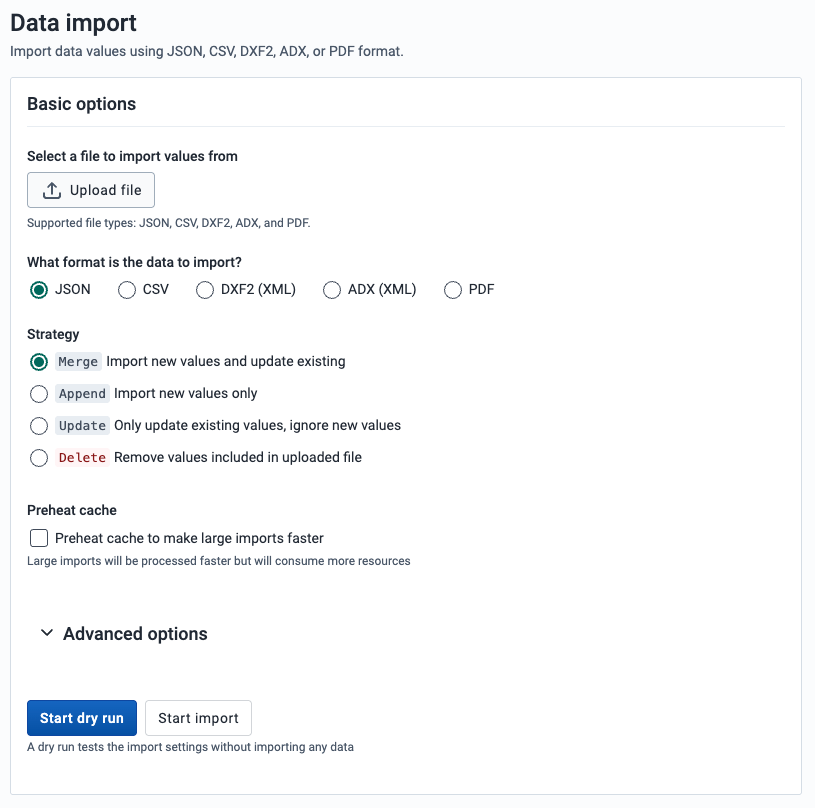

1.  Choose a file to upload.

2.  Select a format: _JSON_, _CSV_, _DXF2 (XML)_, _ADX (XML)_, or _PDF_.

3.  Select the appropriate settings for:

    -   Strategy (how values should be imported)
    -   Preheat cache (speed up import by using a temporary cache map)
    -   Skip audit (disabling audit can speed up import)

4.  Click **Advanced options** if you want to adjust one or more of
    the following settings before importing:

    -   Data element ID scheme
    -   Organisation unit ID scheme
    -   ID scheme
    -   Skip existing check (can improve performance but is recommended for empty databases or where you are sure data does not exist)

5.  Click **Start import** to upload the file and start the import.

> **Tip**
>
> It is highly recommended to use the **Dry run** option to test before importing data.
> This keeps you in control of any changes to your metadata, and lets you check for
> problems with out-of-sync data elements or organisation unit names.

#### PDF data { #importPDFdata }

DHIS2 can import data in the PDF format. This can be used to
import data produced by offline PDF data entry forms. For details on how to
produce a PDF form for offline data entry, see the section **Data set
management**.

To import a PDF data file, open _Data import_ from the sidebar, select _PDF_ as the format, upload the completed PDF file and click **Start import**.

### Event import { #event_import }

In the sidebar, click **Event import**.

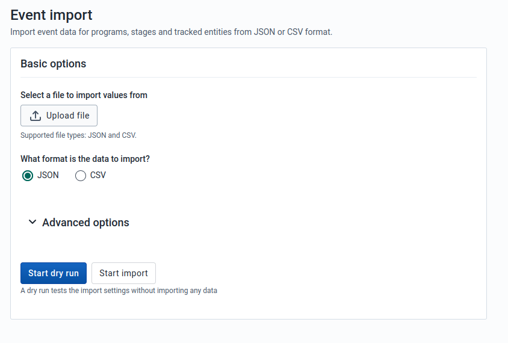

1.  Select a format: _JSON_ or _CSV_.

2.  Click **Advanced options** if you want to adjust one or more of
    the following settings before importing:

    -   Data element ID scheme
    -   Organisation unit ID scheme
    -   ID scheme

3.  Click **Start import** to upload the file and start the import.

#### Version 2.40 and earlier

The format also included _XML_.

### Earth Engine import { #ee_import }

In the sidebar, click **Earth Engine import**.

Import high resolution population data from WorldPop using Google Earth Engine. A [Google
Earth Engine account](https://docs.dhis2.org/en/topics/tutorials/google-earth-engine-sign-up.html) is required to use this importer.

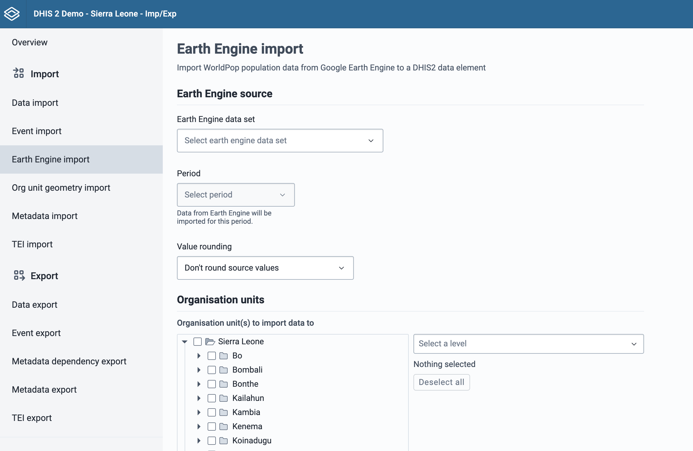

#### Select which Earth Engine data should be imported

The first section of the form is used to configure the Earth Engine data to import.

1. Select which Earth Engine dataset should be imported. The choices are _Population WorldPop Global2_ and _Population age groups WorldPop Global2_.

2. After you select a dataset, you must select a period. You can import only one period at a time.

3. Choose how to round the data. By default, DHIS2 does not round the data.

4. Select which organisation units to import data to. If you select facility-level organisation units, you must choose an associated geometry for the facilities. Without an associated geometry for facilities, Earth Engine cannot determine the population.

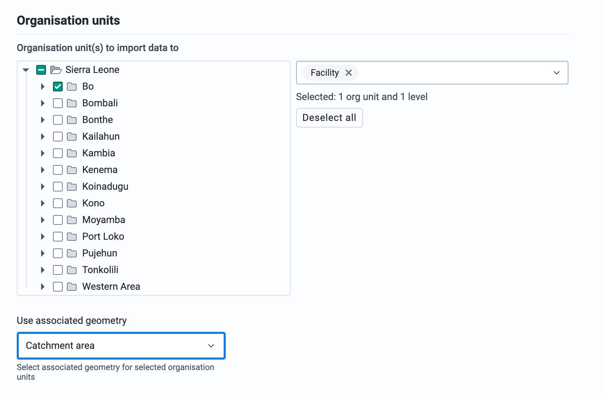

#### Select the data elements to import the Earth Engine data into

After you configure the Earth Engine dataset, select the data element to import the data to. For datasets with disaggregation groups, such as "Population age groups", the DHIS2 data element must have disaggregations in the form of category option combos that match the Earth Engine dataset disaggregation groups.

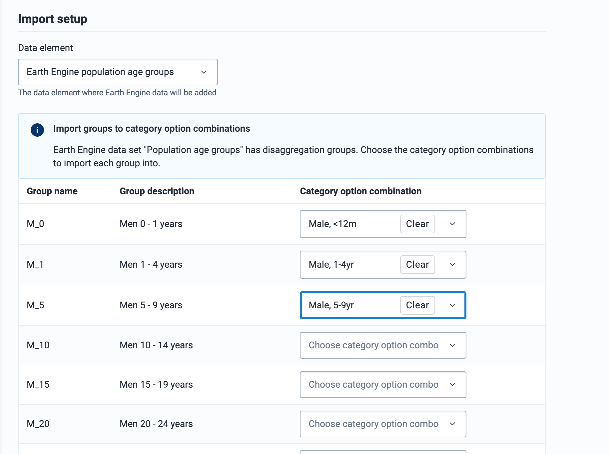

> **Configuring data elements for Earth Engine import**
>
> If you plan to import data to multiple org unit levels, make sure those levels are added as Aggregation Levels in the configuration of the DHIS2 data elements that contain Earth Engine data.
>
> Some Earth Engine datasets contain disaggregation groups. For these datasets, the DHIS2 data element must be configured with corresponding category option combos. For example, the "Population age groups" dataset is disaggregated by gender (Male, Female) and 5-year age groups.
>
> In DHIS2, this means you must have a Male/Female category and a 5-year age group category (<1yr, 1-4yr, 5-9yr, 10-14yr... 90+yr). These are combined into a category combination.
>
> To match the category option combo to the Earth Engine disaggregation group automatically, add a Code to each category option combo that matches the Earth Engine group name. For example, with "Population age groups", the groups are named: F_00, F_01, F_05..., M_00, M_01, M_05...

#### Run the import

After you select the data element and category option combos, the **Preview before import** button is enabled. After you review the data you want to import, you can do a dry run first, or continue with the actual import.

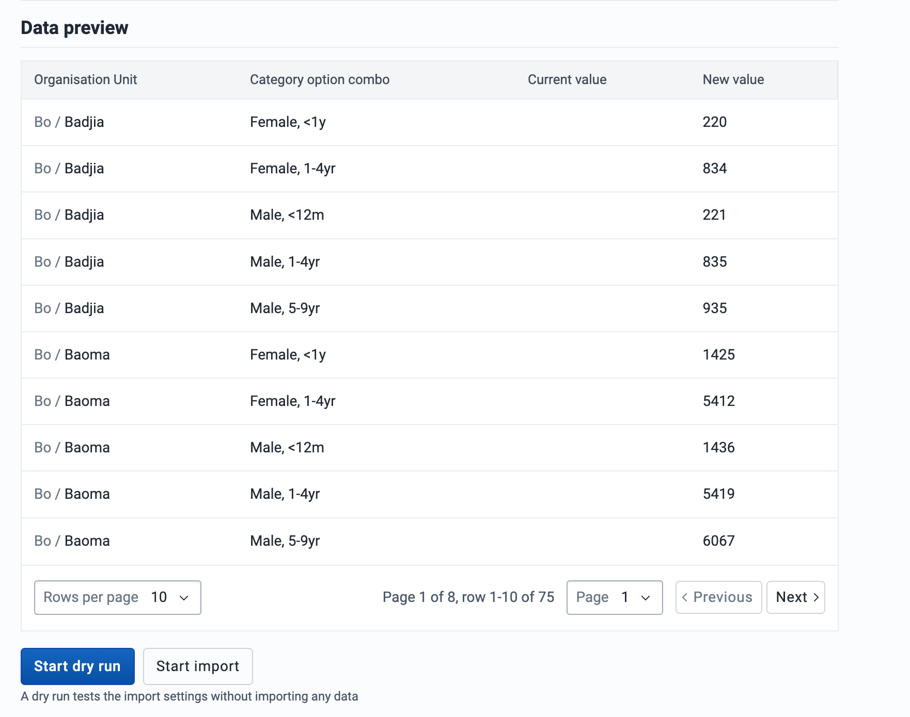

### Organisation unit geometry import { #geometry_import }

In the sidebar, click **Org unit geometry import**.

Two geometry formats are supported: **GeoJSON** and **GML**. GeoJSON is the recommended format, and it is the only format that can be used to import associated geometries (for example, catchment areas). GML support is limited to version 2.0. It is kept for convenience and is not planned to be extended or enhanced in future releases.

See also the [Maps configuration guide](https://docs.dhis2.org/en/use/user-guides/dhis-core-version-master/configuring-the-system/maps.html) for preparing your source data before import (converting to GeoJSON/GML, required coordinate reference system, simplifying complex geometries) and for troubleshooting common import errors.

#### GeoJSON import { #geojson_import }

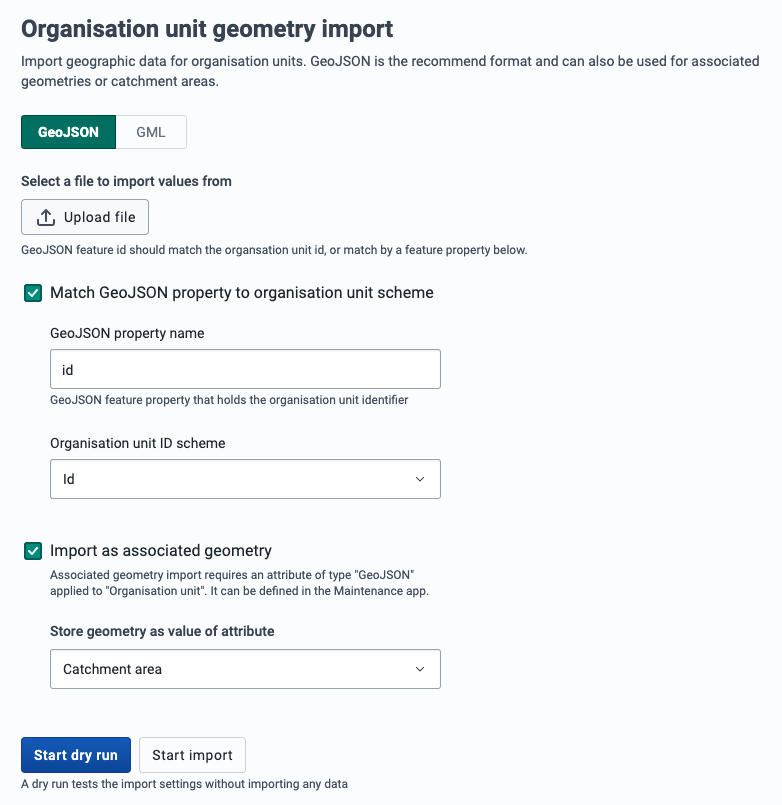

1. Upload a file in GeoJSON format. By default, the import matches each GeoJSON feature's `id` to the corresponding organisation unit ID.

2. Before importing, it is strongly recommended to check **Dry run** to preview the changes without applying them. This keeps you in control of any changes to your organisation unit geometries.

3. Click **Start import** to upload the file and begin the import process.

##### Optional settings

These settings change how the import behaves, and can be combined with the steps above as needed:

-   **Match by a different property:** By default, matching is done on the organisation unit ID, using the GeoJSON feature's top-level `id` member (not a property inside `"properties"`). To match on a different property instead, check **Match GeoJSON property to organisation unit scheme**. Enter the GeoJSON property name and select the organisation unit ID scheme to match against (**ID**, **Code**, or **Name**).

-   **Import as associated geometry:** To import the GeoJSON features as associated geometries (for example, catchment areas) rather than the organisation unit's main geometry, check **Import as associated geometry** and select the geometry attribute to import the data into. This requires an attribute of type **GeoJSON** assigned to the Organisation unit type. You can create it in the **Metadata management app**, the newer app that is taking over the Maintenance app's configuration screens. Until the Maintenance app is retired in v44, you can use either app to create it.

##### GeoJSON structure examples

Default matching, where the feature's top-level `id` refers to the organisation unit ID:

```json
{
    "type": "FeatureCollection",
    "features": [
        {
            "type": "Feature",
            "id": "O6uvpzGd5pu",
            "geometry": { "type": "Point", "coordinates": [12.34, 56.78] }
        }
    ]
}
```

Matching by a property (for example, Code), where the identifier is placed inside `"properties"` instead:

```json
{
    "type": "FeatureCollection",
    "features": [
        {
            "type": "Feature",
            "properties": { "code": "OU1_CODE" },
            "geometry": { "type": "Point", "coordinates": [12.34, 56.78] }
        }
    ]
}
```

#### GML import { #gml_import }

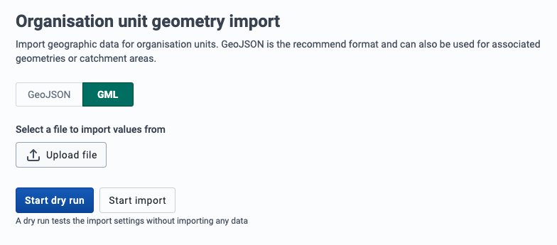

1. Upload a file in **GML 2.0** format. Only GML 2.0 is supported.

2. Before importing, it is strongly recommended to check **Dry run** to preview the changes without applying them. This keeps you in control of any changes to your organisation unit geometries.

3. Click **Start import** to upload the file and begin the import process.

> **Note:** GML support is retained for convenience but is not being actively developed. **GeoJSON is the recommended format** for organisation unit geometry import.

### Tracked entities import { #tei_import }

In the sidebar, click **Tracked entity import**.

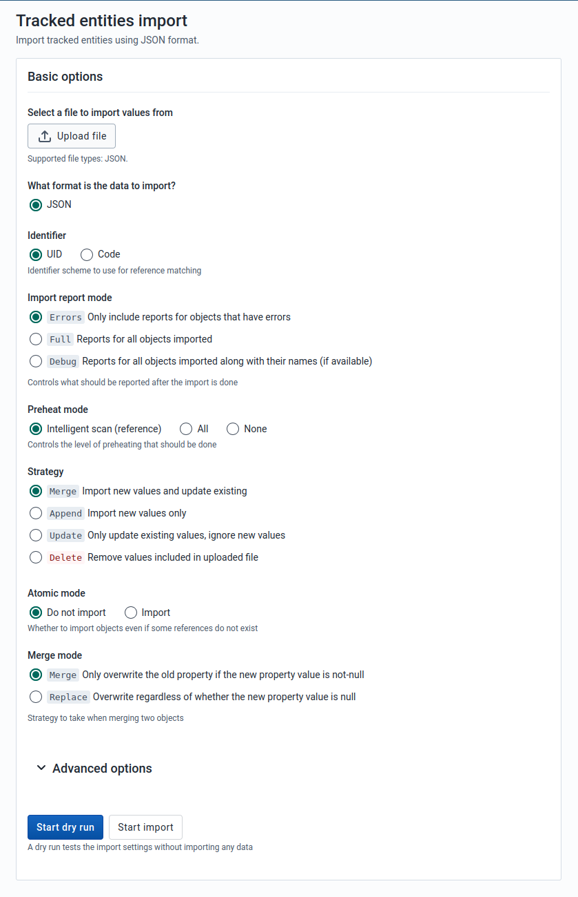

1.  Choose a JSON file to upload.

1.  Select the appropriate settings for:

    -   Identifier (whether to match existing metadata on UID or code)
    -   Import report mode (level of detail reported after import has finished)
    -   Preheat mode (controls how system preloads/caches metadata before import)
    -   Strategy (how values should be imported)
    -   Atomic mode (controls what happens when some objects in the import are invalid)
    -   Merge mode (strategy when merging objects)

1.  Click **Advanced options** if you want to adjust one or more of
    the following settings before importing:

    -   Flush mode (controls when to flush the internal cache)
    -   Skip sharing (whether to include or ignore sharing on import)
    -   Skip validation (whether to bypass validation checks during import)
    -   Inclusion strategy (controls which properties to include)
    -   Data element ID scheme
    -   Organisation unit ID scheme
    -   ID scheme

1.  Click **Start import** to upload the file and start the import.

#### Version 2.40 and earlier

Format required a separate selection step before upload: _JSON_ or _XML_. From 2.41 the app only accepts JSON, so this step was removed entirely.

> **Tip**
>
> It is highly recommended to use the **Dry run** option to test before importing data.
> This keeps you in control of any changes to your tracked entities.

## Exporting data

### Metadata export { #metadata_export }

In the sidebar, click **Metadata export**.

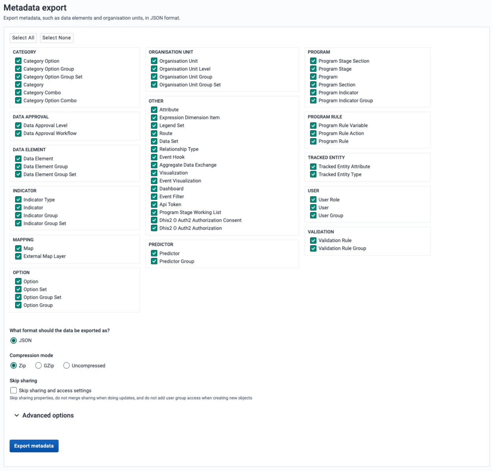

1.  Choose the list of objects you want to export.

2.  Select a format: _JSON_.

3.  Select a compression type: _zip_, _gzip_ or _uncompressed_.

4.  Decide whether to check _Skip sharing and access settings_.

5.  Under advanced options, you can change the Inclusion strategy (controls which properties are included).

6.  Click **Export metadata**. A new browser window opens with a file to download to your
    computer.

### Metadata export with dependencies { #metadata_export_dependencies }

Metadata export with dependencies lets you create ready-made exports for
metadata objects. This type of export includes the metadata objects
and the metadata object's related objects; that is, the metadata that
belongs together with the main object.

Table: Object types and their dependencies

| Object type          | Dependencies included in export                                                                                                                                                                                                                                                                                                                                                                                                                                                                                                                  |
| -------------------- | ------------------------------------------------------------------------------------------------------------------------------------------------------------------------------------------------------------------------------------------------------------------------------------------------------------------------------------------------------------------------------------------------------------------------------------------------------------------------------------------------------------------------------------------------ |
| **Data sets**        | Data elements<br> <br>Sections<br> <br>Indicators<br> <br>Indicator types<br> <br>Attributes<br> <br>Data entry forms<br> <br>Legend sets<br> <br>Legends<br> <br>Category combinations<br> <br>Categories<br> <br>Category options<br> <br>Category option combinations<br> <br>Option sets<br> <br>Options                                                                                                                                                                                                                                     |
| Programs             | Data entry form<br> <br>Tracked entity<br> <br>Program stages<br> <br>Program indicators<br> <br>Program rules<br> <br>Program rule actions<br> <br>Program rule variables<br> <br>Program attributes<br> <br>Data elements<br> <br>Category combinations<br> <br>Categories<br> <br>Category options<br> <br>Category option combinations<br> <br>Option sets<br> <br>Program sections<br> <br>Program stage sections<br> <br>Notification templates<br> <br>Option groups<br> <br>Options<br> <br>Tracked entity attributes<br> <br>Attributes |
| Category combination | Category combinations<br> <br>Categories<br> <br>Category options<br> <br>Category option combinations<br> <br>Attributes                                                                                                                                                                                                                                                                                                                                                                                                                        |
| Dashboard            | Dashboard items<br> <br>Charts<br> <br>Event charts<br> <br>Pivot tables<br> <br>Event reports<br> <br>Maps<br> <br>Reports<br> <br>Resources<br> <br>Event visualizations<br> <br>Interpretations                                                                                                                                                                                                                                                                                                                                               |
| Data element groups  | Data elements<br> <br>Category combinations<br> <br>Categories<br> <br>Category options<br> <br>Category option combinations<br> <br>Option sets<br> <br>Attributes<br> <br>Legend sets<br> <br>Legends<br> <br>Options                                                                                                                                                                                                                                                                                                                          |
| Option sets          | Option                                                                                                                                                                                                                                                                                                                                                                                                                                                                                                                                           |

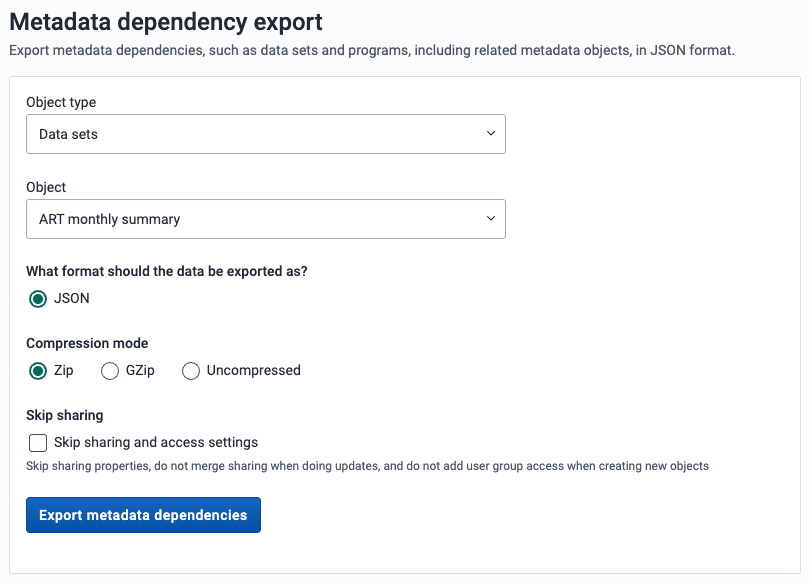

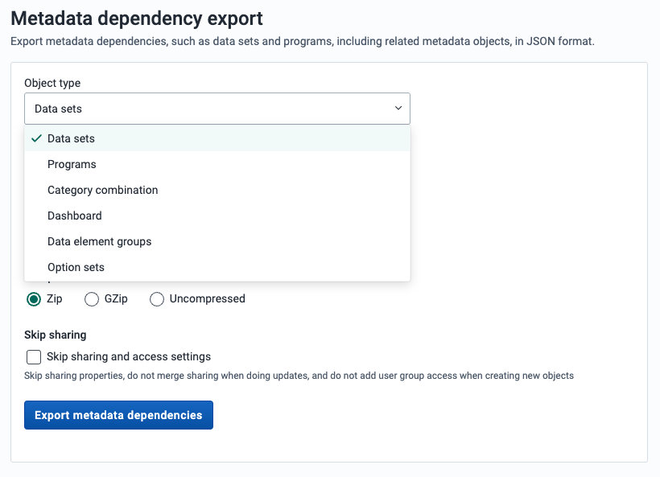

1.  Select an object type: _Data sets_, _Programs_, _Category combination_,
    _Dashboard_, _Data element groups_ or _Option sets_.

2.  Select an object.

3.  Select a format: _JSON_.

4.  Select a compression type: _Zip_, _GZip_ or _Uncompressed_.

5.  Click **Export metadata dependencies**. A new browser window opens with a file to download to your
    computer.

### Data export { #data_export }

In the sidebar, click **Data export**.

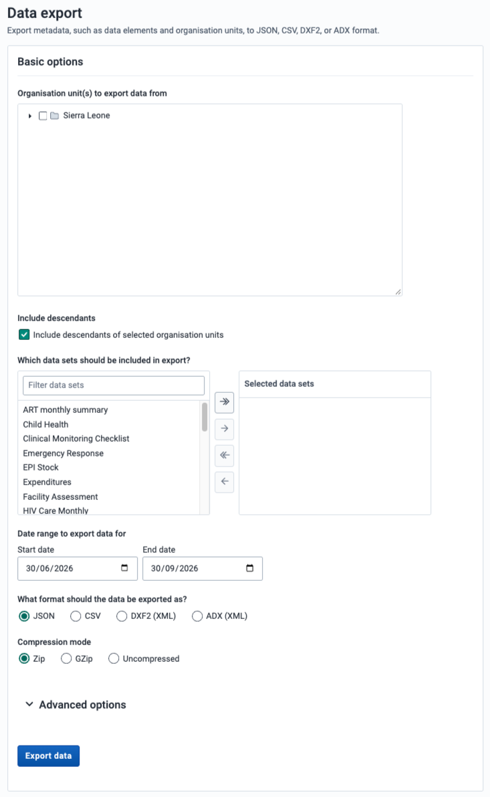

1.  Select which organisation units to export from.

2.  Select whether to include descendants of the organisation
    units selected in step 1, or only the manually selected
    organisation units.

3.  Select which data sets to export.

4.  Set the start and end date.

5.  Select a format: _JSON_, _CSV_, _DXF2 (XML)_, or _ADX (XML)_.

6.  Select a compression mode: **Zip**, **GZip** or **Uncompressed**.

7.  Click **Advanced options** if you want to adjust one or more of
    the following settings before exporting:

    -   Include deleted
    -   Data element ID scheme
    -   Organisation unit ID scheme
    -   ID scheme

8.  Click **Export data**. A new browser window opens with a file to download to your
    computer.

### Event export { #event_export }

In the sidebar, click **Event export**.

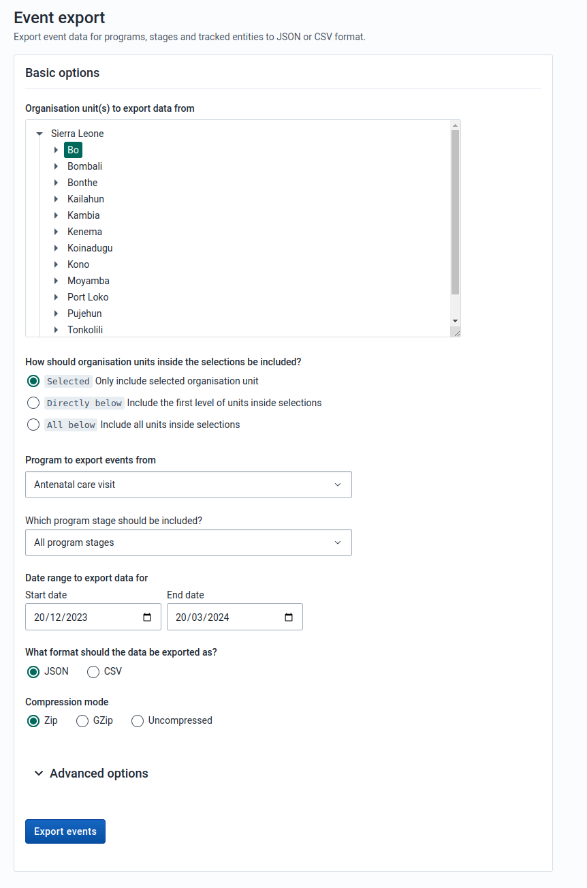

You can export event or tracker data in JSON or CSV.

1.  Select an organisation unit.

1.  Select the inclusion:

    -   _Selected_: Export event data only for the selected
        organisation unit

    -   _Directly below_: Export event data including the first
        level of the organisation units inside the selections as well
        as the selected organisation unit itself.

    -   _All below_: Export event data for all organisation units
        inside the selections as well as the selected organisation
        unit itself.

1.  Select a program and a program stage (if applicable).

1.  Set the start date and end date.

1.  Select a format: _JSON_ or _CSV_.

1.  Select a compression mode: _Zip_, _GZip_ or _Uncompressed_.

1.  Click **Advanced options** if you want to adjust one or more of
    the following settings before exporting:

    -   Include deleted
    -   Data element ID scheme
    -   Organisation unit ID scheme
    -   ID scheme

1.  Click **Export events**. A new browser window opens with a file to download to your
    computer.

#### Version 2.40 and earlier

The format also included _XML_.

### Tracked entities export { #tei_export }

In the sidebar, click **Tracked entity export**.

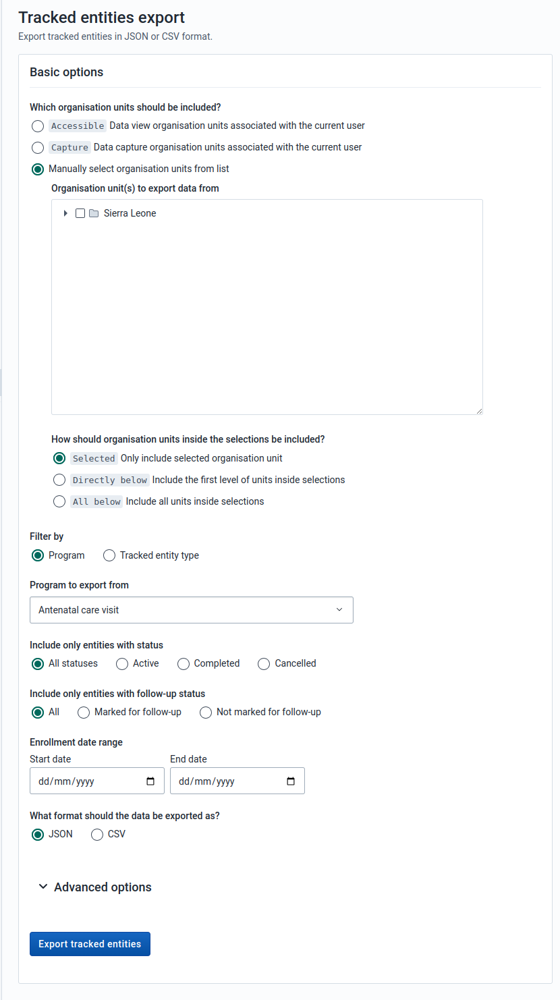

You can export tracked entities in JSON or CSV format.

1.  Select the organisation units that should be included. There are three modes for selecting organisation units:

    -   _Accessible_: to select data view organisation units associated with the current user

    -   _Capture_: to select data capture organisation units associated with the current user.

    -   _Manually select organisation units_: to manually select the organisation units.

1.  If you choose _manually select organisation units_, further options appear:

    -   _Selected_: Export data only for the selected
        organisation unit

    -   _Directly below_: Export data including the first
        level of the organisation units inside the selections as well
        as the selected organisation unit itself.

    -   _All below_: Export data for all organisation units
        inside the selections as well as the selected organisation
        unit itself.

1.  Decide whether you want to filter by _program_ or _tracked entity type_.

1.  Decide what statuses to include in the export.

1.  Decide which follow-up statuses to include in the export.

1.  Select a format: _JSON_ or _CSV_.

1.  Click **Advanced options** if you want to adjust one or more of
    the following settings before exporting:

    -   Filter by last updated date
    -   Filter by assigned user
    -   Include deleted
    -   Data element ID scheme
    -   Organisation unit ID scheme
    -   ID scheme

1.  Click **Export tracked entities**. A new browser window opens with a file to download to your
    computer.

#### Version 2.40 and earlier

The format also included _XML_.

## Differences in version 2.41 and later { #v41_tracker_changes }

The Import/Export app was upgraded to use the new tracker API for importing and exporting tracked entities and events. The deprecated tracker API was removed in v42, so all applications were advised to upgrade as soon as possible.

This improved the consistency and reliability of importing and exporting tracked entities and events, with better validation, better error reporting, and a more reliable job scheduling workflow.

These changes have two important caveats. First, the new format of the exported files is incompatible with previous versions of the app: exports from v41 cannot be imported in previous versions, and exports from previous versions cannot be imported in v41. Second, XML format support was dropped, leaving only JSON and CSV.

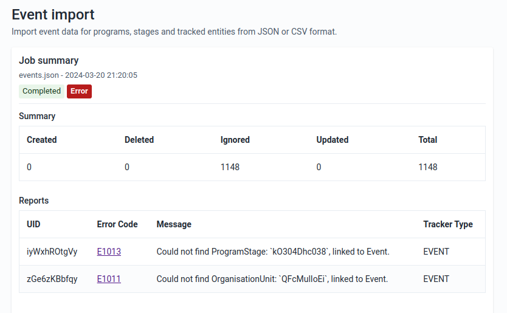

## Job overview { #job_overview }

In the sidebar, click **Job overview** to open the job overview page.

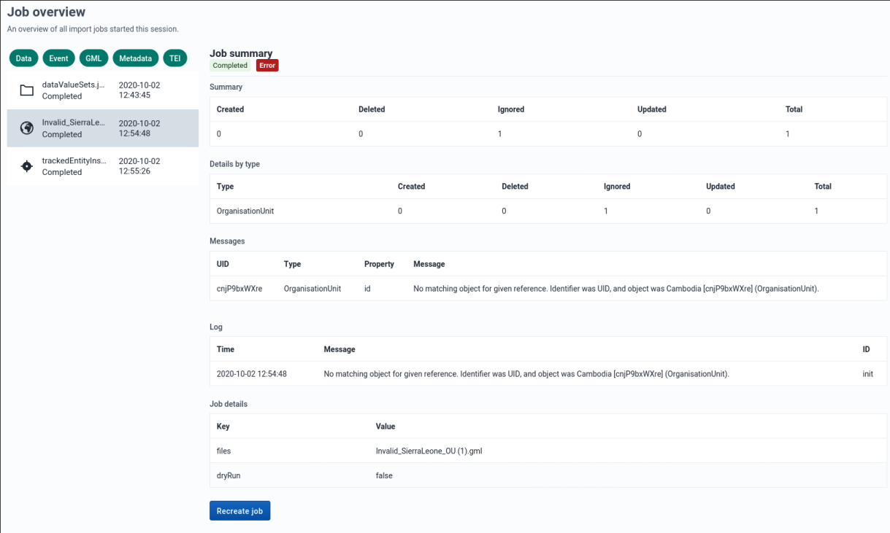

This page shows the progress of all the imports you have started in this
session. The list of all jobs is on the left side, and details about the selected job are on the right.

### Filtering by import job type


By default, the job list shows jobs of all import types. To filter the list, click the job
type filters above it.

### Recreating a previous job


To recreate a previous import job, select the job in the list and click
**Recreate job** at the bottom of the page. The app opens the correct import
page and fills in all the form details exactly as in the job you chose to
recreate.

## Schemes

The various schemes used in many of the import and export pages are
also known as identifier schemes. They map metadata objects
to other metadata during import, and render metadata as part of
exports.

Table: Available values

| Scheme       | Description                                                                                                                                                                                                                                                                                                                                                         |
| ------------ | ------------------------------------------------------------------------------------------------------------------------------------------------------------------------------------------------------------------------------------------------------------------------------------------------------------------------------------------------------------------- |
| ID, UID      | Match on the DHIS2 stable identifier. This is the default ID scheme.                                                                                                                                                                                                                                                                                                    |
| CODE         | Match on the DHIS2 code. This is mainly used to exchange data with an external system.                                                                                                                                                                                                                                                                                          |
| NAME         | Match on the DHIS2 name. This uses what is available as _object.name_, not the translated name. Names are not always unique, and you cannot use a name that is not unique.                                                                                                                                                                |
| ATTRIBUTE:ID | Match on a metadata attribute. The attribute must be assigned to the type you are matching on, and its unique property must be set to _true_. This is also mainly used to exchange data with external systems. It has an advantage over _CODE_: you can add multiple attributes, so you can synchronize with more than one system. |

### ID scheme

The ID scheme applies to all types of objects, but can be overwritten
by more specific object types.
